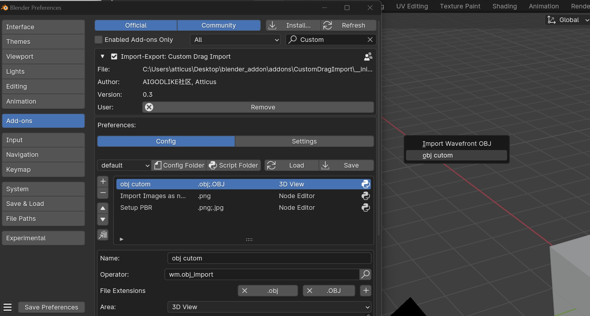
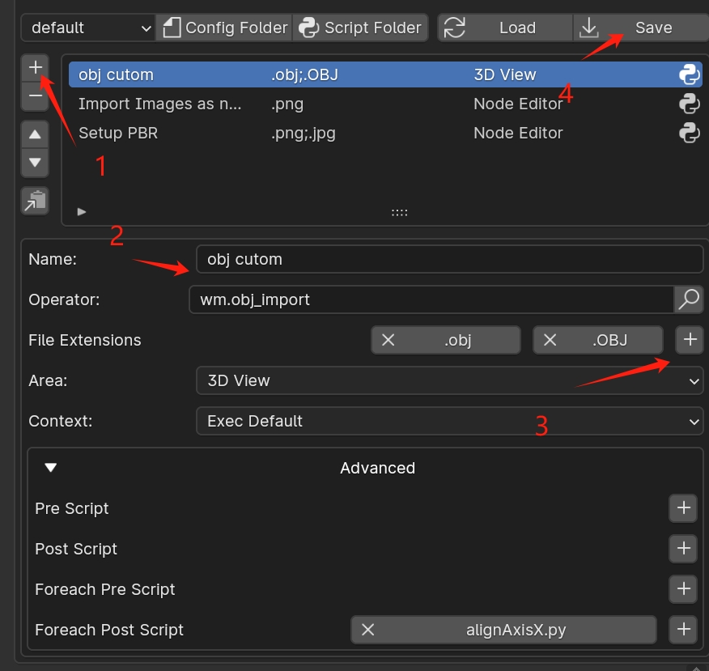

## Intro

Custom drag import is a blender addon that allow you to custom your drag import handle
You can add your custom drag config, and set your custom scripts to do something after import



## How to setup a custom config

1. click the add button
2. add name
3. add file extensions
4. save config

Config will be save to `CustomDragImport\asset\config\default.json`, **make sure to copy it when update addon**



## Config Struct

Config Struct
```json
{
    "obj cutom": {
        "bl_import_operator": "wm.obj_import",
        "bl_file_extensions": ".obj;.OBJ",
        "poll_area": "VIEW_3D",
        "operator_context": "EXEC_DEFAULT",
        "foreach_post_script": "alignAxisX.py"
    },
	...
}
```

## Advance 

You are allow to use built-in script to modifier your object after import a file

#### Pre Script

before import all file, execute it

#### Post Script 

After Import All Files, execute it

#### For each pre Script

Before Import Each File, execute it

#### For each post Script

After Import Each File, execute it

### Built-In scripts

**Post Script** 

+ dropOnSurface.py: place import file on where your mouse click the import menu
+ importFileAsNodes.py: allow to import more that one image as nodes in 4.1(4.2 is supported by default)
+ setupPBRTextures.py: allow to setup pbr textures for drag images(select a bsdf prin node first)

**For each post Script**

+  addCollection.py:  add collection for the import file which name with filename
+  alignAxisX.py: align objects on x axis
+  drop2floor.py: drop every object to floor basic

**Example**

+ printArgs.py: see [Script Example](# Custom Script Example)
+ viewSelect.py: view select after import 

### Custom Script Example

You can use args which provided by this addon 

```python 
import bpy

from cdi_tool.debugLog import DebugLog

event = globals().get('event')
# each
filepath = globals().get('filepath')
index = globals().get('index')
selected_objects = globals().get('selected_objects')
selected_nodes = globals().get('selected_nodes')
# all
directory = globals().get('directory')
files = globals().get('files')

logger = DebugLog()
logger.debug(f'event:{event}\n'
             f'filepath:{filepath}\n'
             f'index:{index}\n'
             f'selected_objects:{selected_objects}\n'
             f'selected_nodes:{selected_nodes}\n'
             f'directory:{directory}\n'
             f'files:{files}\n')

```

